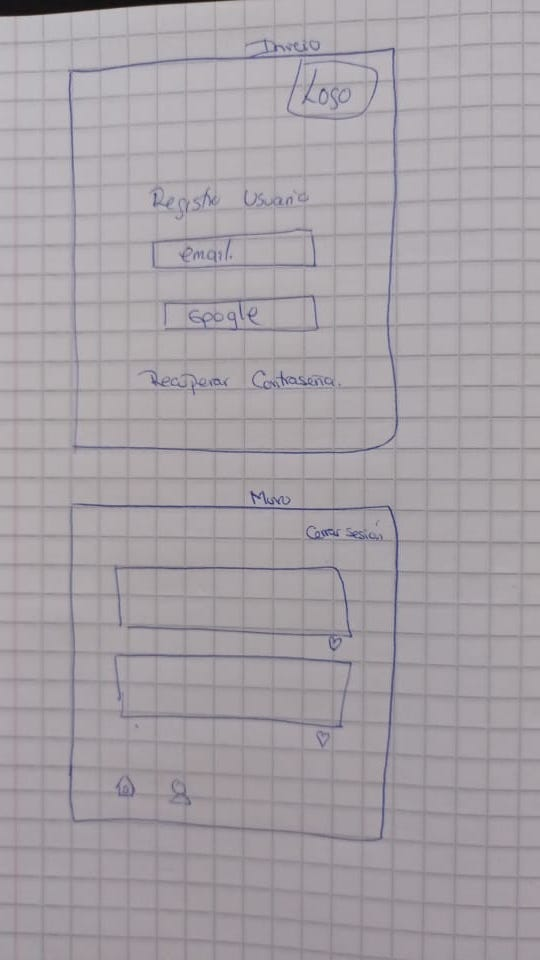
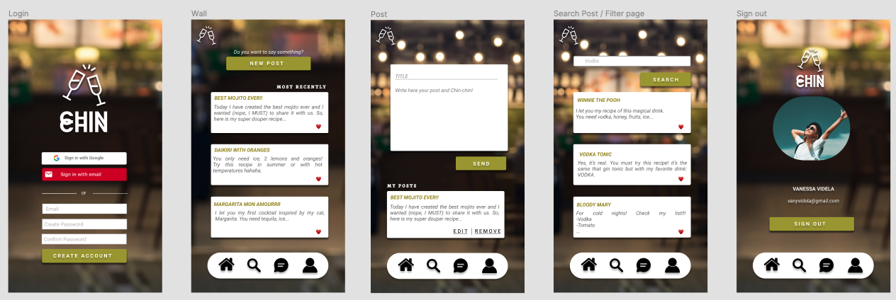
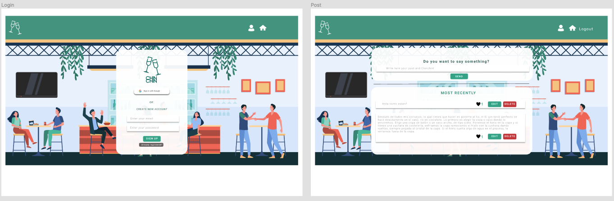
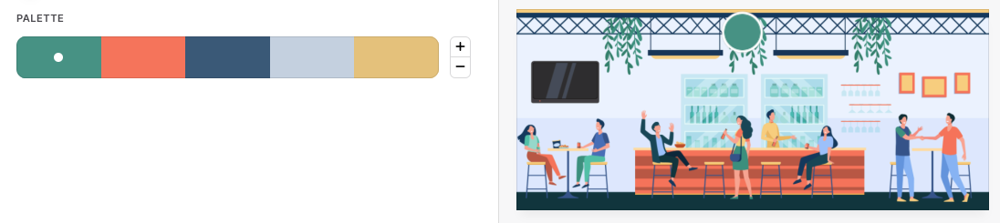
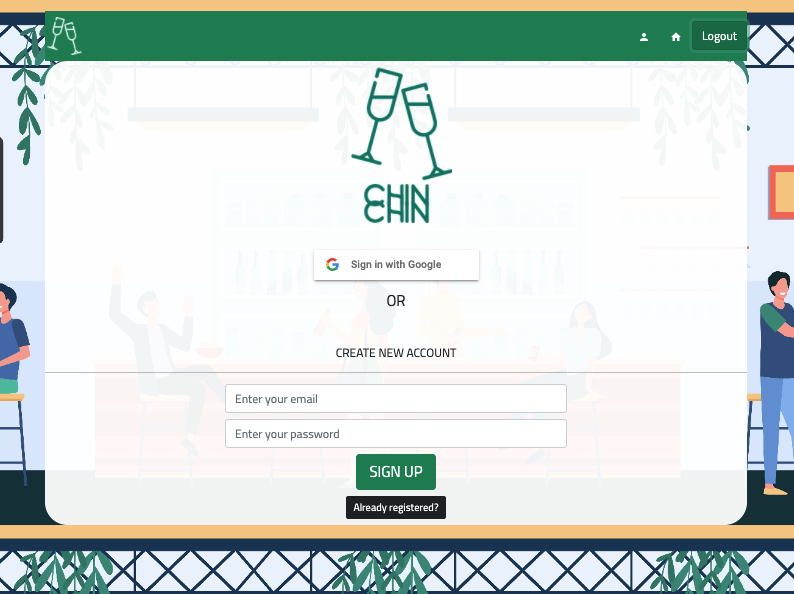

# CHIN·CHIN 🥂 Do you want a drink?  
## Red social con Framework
### Creado por Vanessa Cuenca & Valeria Videla 👩🏽‍💻👩🏽‍💻🥂

## Índice

* [1. Tecnologías/Herramientas utilizadas](#1-tecnologías/herramientas-usadas)
* [2. Preview](#3-preview)
* [3. Definición del producto](#4-definición-del-producto)
* [4. Historias de usuario/Features](#5-historias-de-usuario/features)
* [5. Prototipo](#6-prototipo)
* [6. Test de usabilidad](#7-test-de-usabilidad)

***

## 1. Tecnologías/Herramientas usadas

- React.js
- React Hooks
- Bootstrap
- Firebase
- CSS
- GitHub

## 3. Preview

## 4. Definición del producto

¿Te ha pasado en más de una ocasión que tienes ganas de preparte un trago rico y no sabes cómo hacerlo? Y que cuando logras decidir qué podrías hacer con los implementos que tienes, abres el buscador y aparecen millones de páginas de recetas con molestos pop-ups de Publicidad mostrándote absolutamente TODO menos la receta? 
Y qué pasaría, si a toda esta intención de crear e indagar haciendo recetas nuevas de cócteles le sumamos el poder interactuar con más personas en todo el mundo que andan creando y compartiendo recetas al igual que tú? No sería divertido poder compartir en directo con estas personas?

¡Nosotras creemos que sí! Y es por eso que nace  
_**CHIN·CHIN**_ 🥂 "Do you want a drink?";  
Una red social para amantes de la coctelería y entusiastas novatos que buscan experimentar con nuevas recetas con pocos recursos.

El proyecto está pensado como una red social en la que te registras, creas tu perfil de usuario y compartes en tu muro diferentes recetas. Nuestra idea es ir mejorando el producto para agregarle más utilidades con el tiempo y así hacer la experiencia de usuario mucho más amable y divertida con el tiempo. Es por eso que queremos mejorarla contínuamente agregando un chat y la posibilidad de que puedas agregar amigos en tu feed.

El _**público objetivo**_ pensado para este proyecto abarca personas entre **25 - 45 años**, 
amantes _en su mayoría_ del mundo de la coctelería, que buscan crear, compartir y encontrar recetas para preparar sus tragos favoritos con ingredientes que puedan encontrar en su casa. Además, es gente sociable que busca no solo encontrar una receta si no poder interactuar con gente con gustos similares. 

## 5. Historias de usuario

Se realizó una breve encuesta a personas que integraran el grupo etario clasificado como público 
objetivo, definiendo así las historias de usuario para dar inicio al prototipo y creación del proyecto.

### HU 1. "Como usuario quiero poder registrarme con mi correo electrónico".
_FEATURES: El usuario debe ser capaz de poder crear un usuario a partir de correo electrónico y contraseña._

* Solución: Crear un display de autenticación con registro de correo electrónico y creación de contraseña.
* Criterio mínimo de aceptación: 
        - Que el usuario quede registrado en la base de datos de Firebase.
        - Que el botón te lleve al muro de inicio de la Red social.
        - Que nos permita el acceso a usuarios con cuentas válidas.

* Product Backlog:

        - Crear proyecto en Firebase.
        - Crear Componente contenedor de AuthEmail.
        - Crear input de correo y creación de contraseña.
        - Crear botón de log in.
        - Crear colección de usuarios en Firebase.
        - Darle funcionalidad al botón para que valide la cuenta con Firebase y la ingrese.
        - Crear aler que me avise si los input están vacíos o inválidos.
        - Crear función que me permita decidir si crear cuenta o iniciar sesión (operador ternario)
        - Añadir estilo a ambos display de acuerdo al diseño en Figma.
        

### HU 2. "Yo como fan de Google quiero enlazar mi cuenta Gmail para más comodidad al iniciar sesion".
_FEATURES: El usuario debe ser capaz de iniciar sesión a la red social con su cuenta Gmail._

* Solución: Crear el botón "Sign in with Google" que te lleve a un display de registro con Gmail.
* Criterios mínimos de aceptación: 
          - Que al presionar el botón Sign in with Google nos lleve al display para "logearse" con Gmail.
          - crear el display y que funcione.
          - Que la cuenta quede registrada en la base de datos de Firebase.
          - Que al iniciar sesión nos lleve al muro de inicio de la Red social.

* Product Backlog:

        - Crear un componente contenedor de AuthGmail.
        - Crear botón de sign in with Google.
        - Darle funcionalidad al botón para que al apretarlo nos lleve a la ventana de autenticación con Gmail.
        - Autorizar el inicio de sesión con Google desde el proyecto de Firebase.
        - Redireccionar para que al iniciar sesión nos lleve al muro de la red social.
        

### HU3. "Como miembro de la Red Social quiero escribir un post en mi muro y poder editarlo cuando quiera".
_FEATURES: El usuario debe ser capaz de escribir posts en un muro y que a su vez ese post se pueda editar y eliminar si lo desea_

* Solución: Poder publicar un post que te de la opción de eliminar si es que deseas o editar y guardar cambios nuevos. Al recargar debo poder ver los textos editados.
* Criterios mínimos de aceptación:
- Poder publicar el post y que quede guardado en Firebase.
- Poder editar y guardar cambios nuevos en el post.
- Poder eliminar el post y pedir confirmación antes de eliminarlo.

* Product Backlog:

        - Crear Componente de Posts.
        - Crear input para escribir nuevo post.
        - crear div contenedor donde irán los posts que quedan guardados.
        - Crear botón para agregar nuevo post (Botón SEND).
        - Crear una colección de Firebase para posts.
        - Darle funcionalidad al botón para que al enviar el post este quede guardado en la colección de Firebase.
        - Crear botones de editar y borrar en los posts.
        - Crear una función que permita hacer un upload de los textos ya guardados en las colecciones, darle esta funcionalidad al botón de editar.
        - Crear una función que permita borrar desde Firebase un post de la colección, otorgar esta funcionalidad al botón Delete.
         

## 6. Prototipo

### Diseño de baja fidelidad

 

Se diseñó un prototipo que cumpliera con las condiciones básicas pedidas por los usuarios, que sea 
interactivo y de fácil acceso. A esta primera interacción le buscamos una estética lúdica que incentivara el uso de la red social.

### Diseño de alta fidelidad

El primer acercamiento al diseño fue un prototipo de alta fidelidad que en su primera versión incorporaba un diseño aludiendo a un bar

Sin embargo, luego de feedback con usuarios acordes a nuestro público objetivo y diferentes iteraciones con usuarios llegamos a una segunda versión

En base a esta nueva versión se generaron opciones complementando con paletas de colores en tonos verdes.

### Diseño final

        - Versión Desktop

   -->

## 7. Test de usabilidad
 
El producto sigue en construcción para ir mejorando la calidad y la experiencia para el usuario.